# Experiment 1 -- Anemia from CBC (9 classes)

_Auto-generated report for the `anemia` experiment._

## 1. Dataset

```
Dataset: anemia -- CBC anemia panel (1232 patients, 9 classes; dropped 49 duplicates)
  samples : 1232
  features: 14 (14 numeric, 0 categorical)
  classes : 9
  class distribution:
      Healthy                             323  (26.2%)
      Normocytic hypochromic anemia       271  (22.0%)
      Normocytic normochromic anemia      255  (20.7%)
      Iron deficiency anemia              184  (14.9%)
      Thrombocytopenia                     72  ( 5.8%)
      Other microcytic anemia              56  ( 4.5%)
      Leukemia                             44  ( 3.6%)
      Macrocytic anemia                    16  ( 1.3%)
      Leukemia with thrombocytopenia       11  ( 0.9%)
```

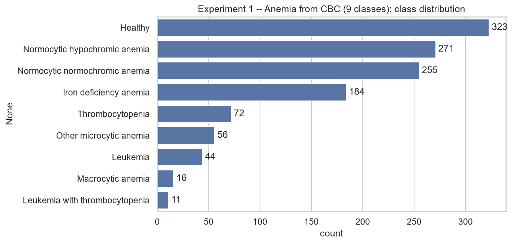

## 2. Stratified 5-fold cross-validation

|                        | accuracy          | macro_f1          | roc_auc_ovr       |
|:-----------------------|:------------------|:------------------|:------------------|
| Random Forest          | 0.9846 +/- 0.0126 | 0.9341 +/- 0.0545 | 0.9996 +/- 0.0004 |
| XGBoost                | 0.9878 +/- 0.0041 | 0.9483 +/- 0.0080 | 0.9994 +/- 0.0004 |
| Hybrid (RF+XGB)        | 0.9870 +/- 0.0066 | 0.9394 +/- 0.0174 | 0.9998 +/- 0.0002 |
| LightGBM               | 0.9894 +/- 0.0062 | 0.9465 +/- 0.0527 | 0.9997 +/- 0.0004 |
| Stacking (RF+XGB+LGBM) | 0.9911 +/- 0.0060 | 0.9660 +/- 0.0250 | 0.9998 +/- 0.0003 |


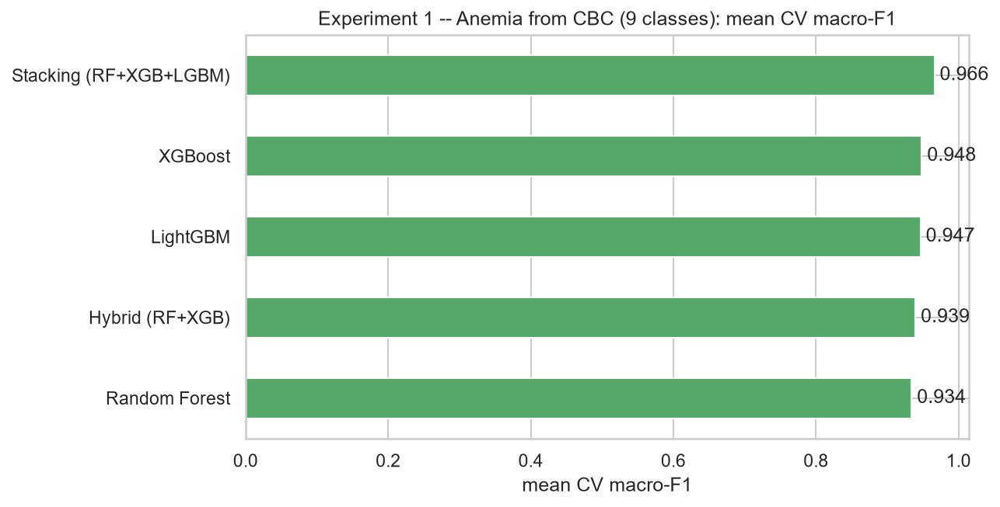

## 3. Statistical significance (paired t-test on fold macro-F1)

```
Paired t-test on 5 paired folds:
  mean(Hybrid (RF+XGB)) - mean(Random Forest) = +0.0053 (Hybrid (RF+XGB) is higher)
  statistic = 0.2381, p = 0.8235
  -> NOT statistically significant at alpha = 0.05 (fail to reject H0: equal performance)
```

## 4. Hold-out test evaluation (final hybrid)


Trained hybrid model saved to `outputs/models/anemia_hybrid_model.joblib`.

| metric | value |
|---|---|
| accuracy | 0.9838 |
| balanced_accuracy | 0.9385 |
| macro_f1 | 0.9467 |
| weighted_f1 | 0.9836 |
| roc_auc_ovr | 0.9997 |


```
                                precision    recall  f1-score   support

                       Healthy     0.9848    1.0000    0.9924        65
 Normocytic hypochromic anemia     0.9815    0.9815    0.9815        54
Normocytic normochromic anemia     1.0000    1.0000    1.0000        51
        Iron deficiency anemia     0.9737    1.0000    0.9867        37
              Thrombocytopenia     1.0000    1.0000    1.0000        15
       Other microcytic anemia     1.0000    0.9091    0.9524        11
                      Leukemia     1.0000    0.8889    0.9412         9
             Macrocytic anemia     0.6667    0.6667    0.6667         3
Leukemia with thrombocytopenia     1.0000    1.0000    1.0000         2

                      accuracy                         0.9838       247
                     macro avg     0.9563    0.9385    0.9467       247
                  weighted avg     0.9840    0.9838    0.9836       247

```


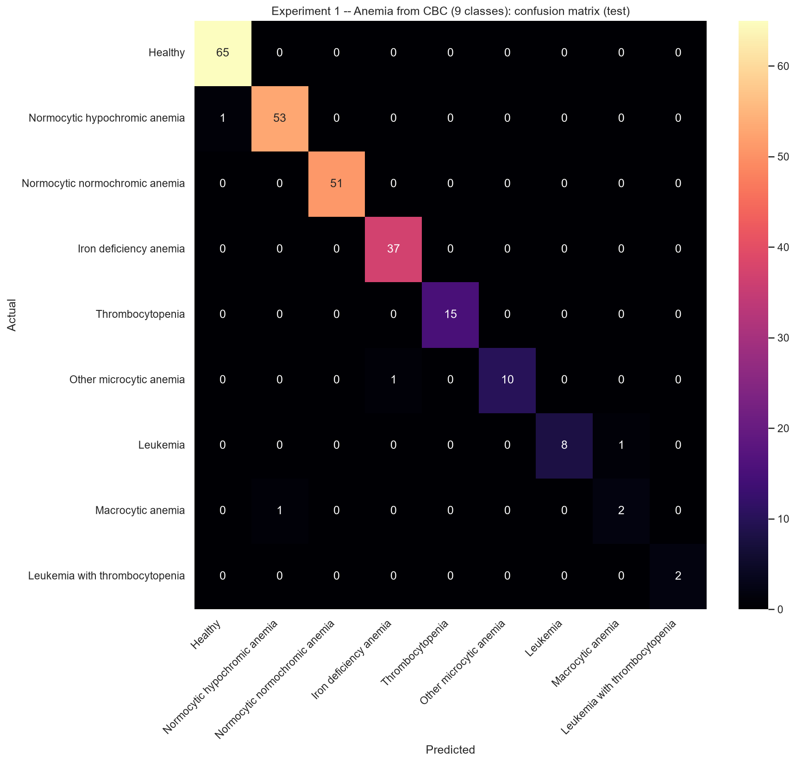


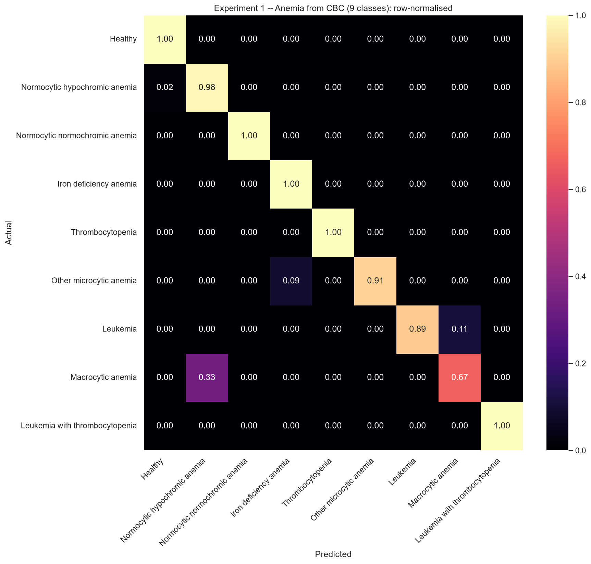


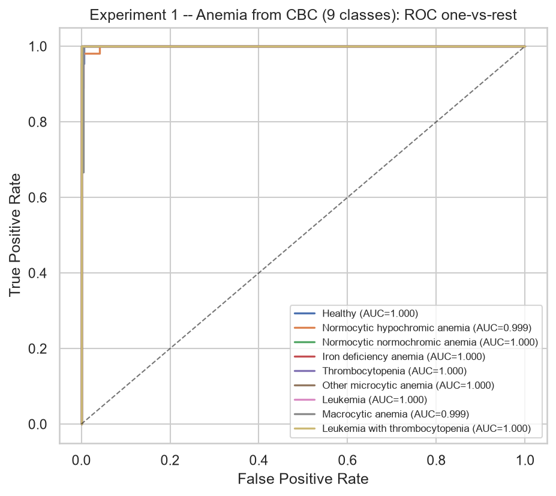

## 5. SHAP global explanation (XGBoost component)

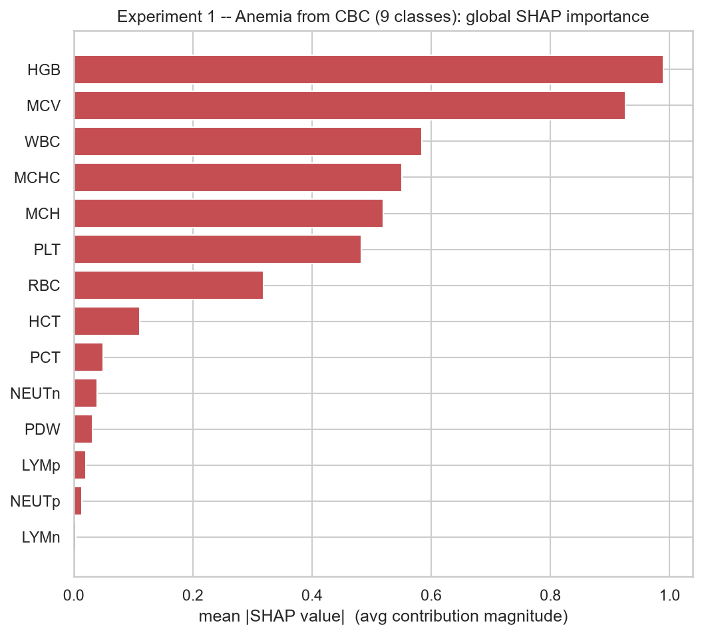


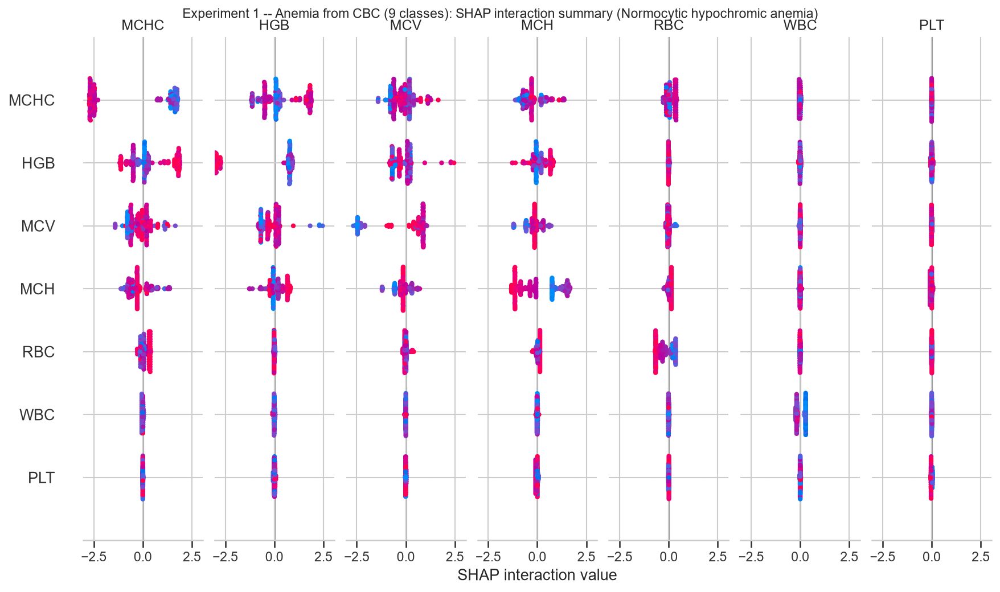


Top global features (mean |SHAP|):

```
HGB      0.989008
MCV      0.926331
WBC      0.583877
MCHC     0.550755
MCH      0.519384
PLT      0.483038
RBC      0.318932
HCT      0.111175
PCT      0.048835
NEUTn    0.038811
PDW      0.031606
LYMp     0.020356
```

## 6. SHAP local explanations -- why each prediction was made

### Example 1 (CORRECT)

```
Patient #1  ->  predicted: Healthy  (confidence 99.7%;  true label: Healthy)
The model's baseline score for 'Healthy' is +1.00. This patient's measurements adjust it as follows:
   HGB                          = 13.7       increases evidence for Healthy by +2.77
   PLT                          = 310        increases evidence for Healthy by +1.09
   WBC                          = 7.8        increases evidence for Healthy by +1.04
   RBC                          = 5.6        increases evidence for Healthy by +0.74
   MCV                          = 93         increases evidence for Healthy by +0.24
   MCH                          = 31         increases evidence for Healthy by +0.18
   PCT                          = 0.26       increases evidence for Healthy by +0.04
   NEUTn                        = 5.14       increases evidence for Healthy by +0.03
Net score for 'Healthy' = +7.22, the highest of all 9 classes -> final prediction: Healthy.
```

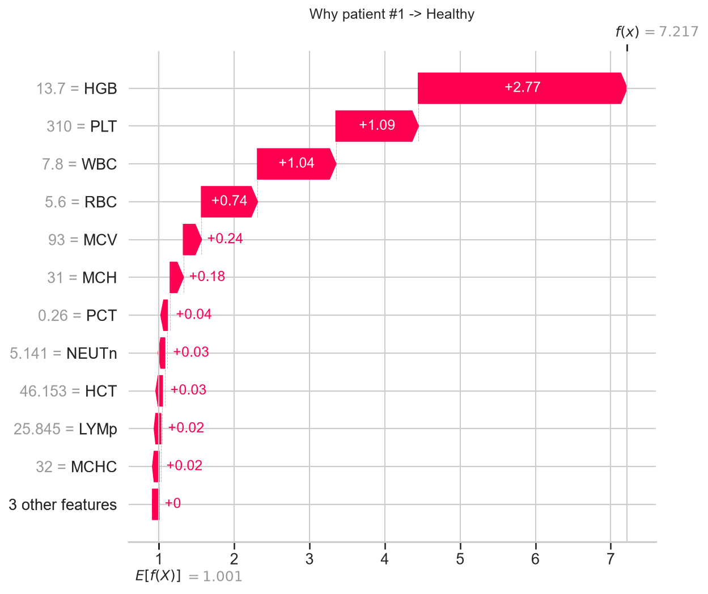

### Example 2 (CORRECT)

```
Patient #3  ->  predicted: Normocytic hypochromic anemia  (confidence 99.5%;  true label: Normocytic hypochromic anemia)
The model's baseline score for 'Normocytic hypochromic anemia' is +0.99. This patient's measurements adjust it as follows:
   MCHC                         = 31.1       increases evidence for Normocytic hypochromic anemia by +1.49
   MCH                          = 25.9       increases evidence for Normocytic hypochromic anemia by +1.41
   MCV                          = 83.3       increases evidence for Normocytic hypochromic anemia by +1.25
   HGB                          = 10.5       increases evidence for Normocytic hypochromic anemia by +1.13
   RBC                          = 4.05       increases evidence for Normocytic hypochromic anemia by +0.40
   WBC                          = 4.7        increases evidence for Normocytic hypochromic anemia by +0.27
   PLT                          = 145        increases evidence for Normocytic hypochromic anemia by +0.02
   NEUTp                        = 65.4       increases evidence for Normocytic hypochromic anemia by +0.02
Net score for 'Normocytic hypochromic anemia' = +7.00, the highest of all 9 classes -> final prediction: Normocytic hypochromic anemia.
```

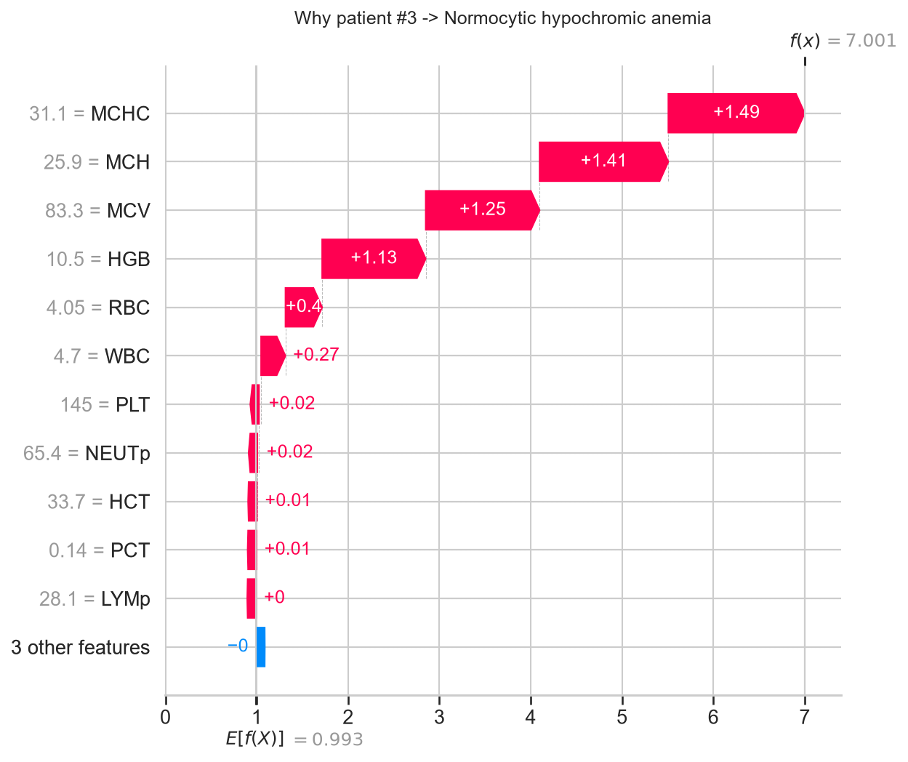

### Example 3 (CORRECT)

```
Patient #11  ->  predicted: Normocytic normochromic anemia  (confidence 99.9%;  true label: Normocytic normochromic anemia)
The model's baseline score for 'Normocytic normochromic anemia' is +0.88. This patient's measurements adjust it as follows:
   HGB                          = 12.2       increases evidence for Normocytic normochromic anemia by +1.64
   MCHC                         = 32         increases evidence for Normocytic normochromic anemia by +1.32
   MCV                          = 89         increases evidence for Normocytic normochromic anemia by +0.50
   WBC                          = 7.5        increases evidence for Normocytic normochromic anemia by +0.25
   MCH                          = 28         increases evidence for Normocytic normochromic anemia by +0.24
   PDW                          = 13.8       decreases evidence for Normocytic normochromic anemia by -0.15
   RBC                          = 4.5        increases evidence for Normocytic normochromic anemia by +0.13
   NEUTp                        = 77.5       increases evidence for Normocytic normochromic anemia by +0.03
Net score for 'Normocytic normochromic anemia' = +4.85, the highest of all 9 classes -> final prediction: Normocytic normochromic anemia.
```

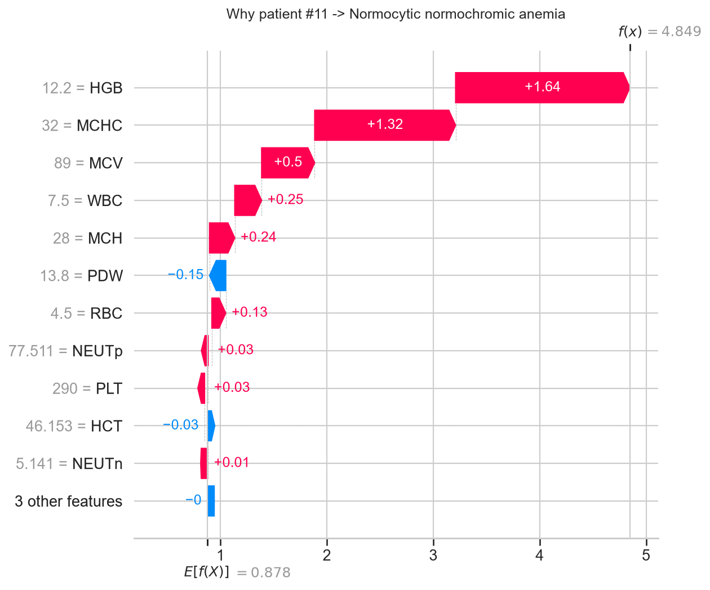

### Example 4 (CORRECT)

```
Patient #0  ->  predicted: Iron deficiency anemia  (confidence 80.7%;  true label: Iron deficiency anemia)
The model's baseline score for 'Iron deficiency anemia' is +1.21. This patient's measurements adjust it as follows:
   MCH                          = 24.4       increases evidence for Iron deficiency anemia by +1.01
   MCV                          = 79.9       increases evidence for Iron deficiency anemia by +0.98
   MCHC                         = 30.5       increases evidence for Iron deficiency anemia by +0.42
   HCT                          = 37.6       increases evidence for Iron deficiency anemia by +0.35
   RBC                          = 4.71       increases evidence for Iron deficiency anemia by +0.08
   HGB                          = 11.5       increases evidence for Iron deficiency anemia by +0.02
   WBC                          = 4.1        decreases evidence for Iron deficiency anemia by -0.02
   LYMn                         = 1.5        increases evidence for Iron deficiency anemia by +0.02
Net score for 'Iron deficiency anemia' = +4.10, the highest of all 9 classes -> final prediction: Iron deficiency anemia.
```

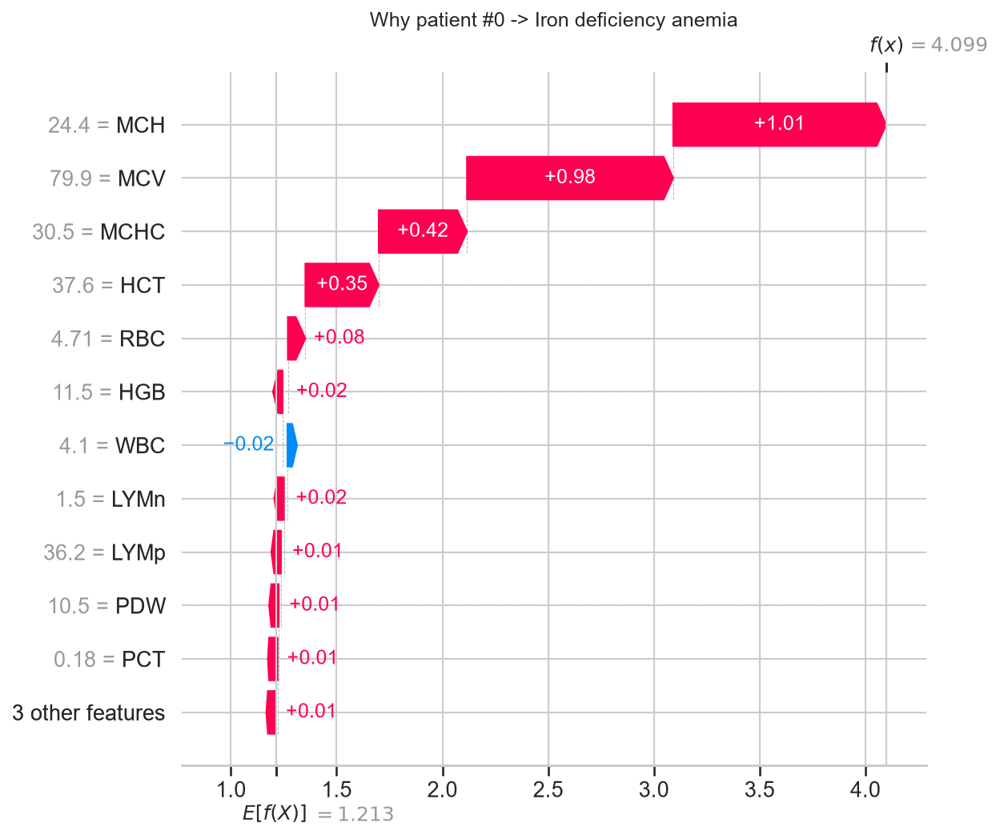

### Example 5 (CORRECT)

```
Patient #53  ->  predicted: Thrombocytopenia  (confidence 82.5%;  true label: Thrombocytopenia)
The model's baseline score for 'Thrombocytopenia' is -0.07. This patient's measurements adjust it as follows:
   PLT                          = 84         increases evidence for Thrombocytopenia by +2.55
   HGB                          = 13.9       increases evidence for Thrombocytopenia by +1.44
   WBC                          = 4.4        increases evidence for Thrombocytopenia by +0.86
   PCT                          = 0.26       decreases evidence for Thrombocytopenia by -0.26
   MCHC                         = 33.2       increases evidence for Thrombocytopenia by +0.19
   HCT                          = 46.2       increases evidence for Thrombocytopenia by +0.18
   RBC                          = 3.48       decreases evidence for Thrombocytopenia by -0.17
   NEUTp                        = 77.5       decreases evidence for Thrombocytopenia by -0.06
Net score for 'Thrombocytopenia' = +4.69, the highest of all 9 classes -> final prediction: Thrombocytopenia.
```

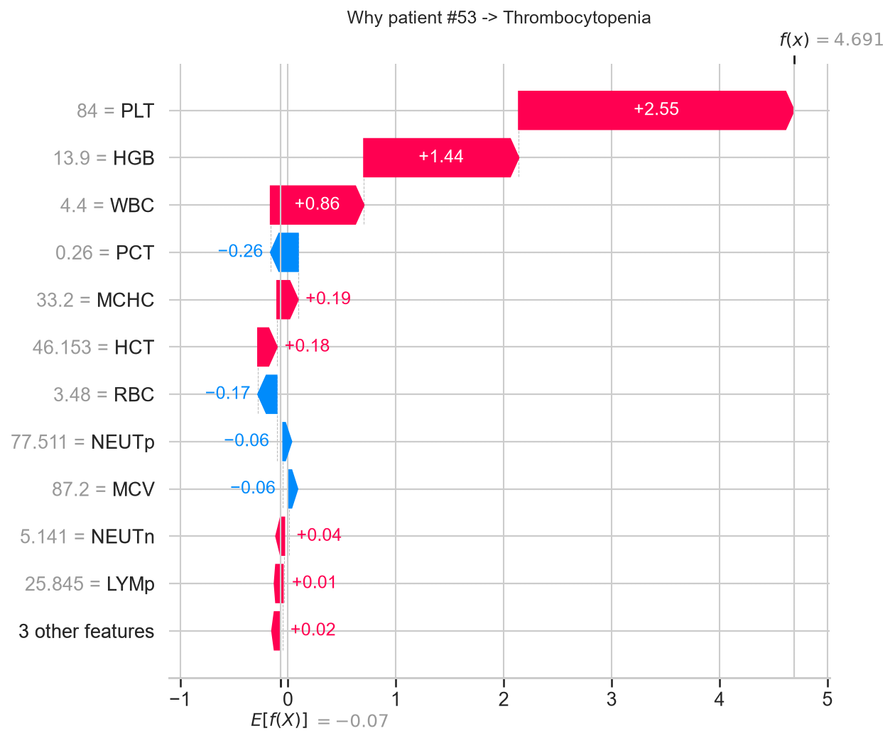

### Example 6 (CORRECT)

```
Patient #4  ->  predicted: Other microcytic anemia  (confidence 74.6%;  true label: Other microcytic anemia)
The model's baseline score for 'Other microcytic anemia' is +0.48. This patient's measurements adjust it as follows:
   MCV                          = 68.8       increases evidence for Other microcytic anemia by +3.60
   MCHC                         = 33         increases evidence for Other microcytic anemia by +1.50
   MCH                          = 22.7       decreases evidence for Other microcytic anemia by -0.43
   WBC                          = 8.4        decreases evidence for Other microcytic anemia by -0.19
   HGB                          = 9.9        increases evidence for Other microcytic anemia by +0.12
   RBC                          = 4.4        decreases evidence for Other microcytic anemia by -0.04
   PLT                          = 133        increases evidence for Other microcytic anemia by +0.03
   PCT                          = 0.12       decreases evidence for Other microcytic anemia by -0.02
Net score for 'Other microcytic anemia' = +5.02, the highest of all 9 classes -> final prediction: Other microcytic anemia.
```

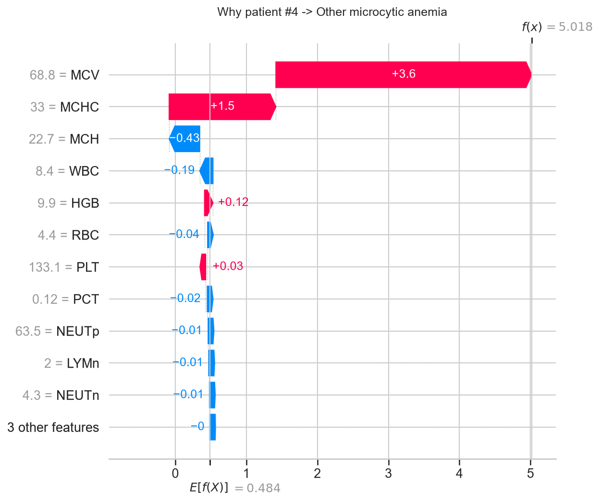

### Example 7 (CORRECT)

```
Patient #16  ->  predicted: Leukemia  (confidence 91.8%;  true label: Leukemia)
The model's baseline score for 'Leukemia' is -0.33. This patient's measurements adjust it as follows:
   WBC                          = 13.8       increases evidence for Leukemia by +3.65
   HGB                          = 14.8       increases evidence for Leukemia by +0.89
   RBC                          = 5.44       increases evidence for Leukemia by +0.67
   PLT                          = 303        increases evidence for Leukemia by +0.60
   MCV                          = 86.8       increases evidence for Leukemia by +0.10
   PCT                          = 0.26       increases evidence for Leukemia by +0.10
   HCT                          = 46.2       increases evidence for Leukemia by +0.07
   PDW                          = 14.3       increases evidence for Leukemia by +0.03
Net score for 'Leukemia' = +5.80, the highest of all 9 classes -> final prediction: Leukemia.
```

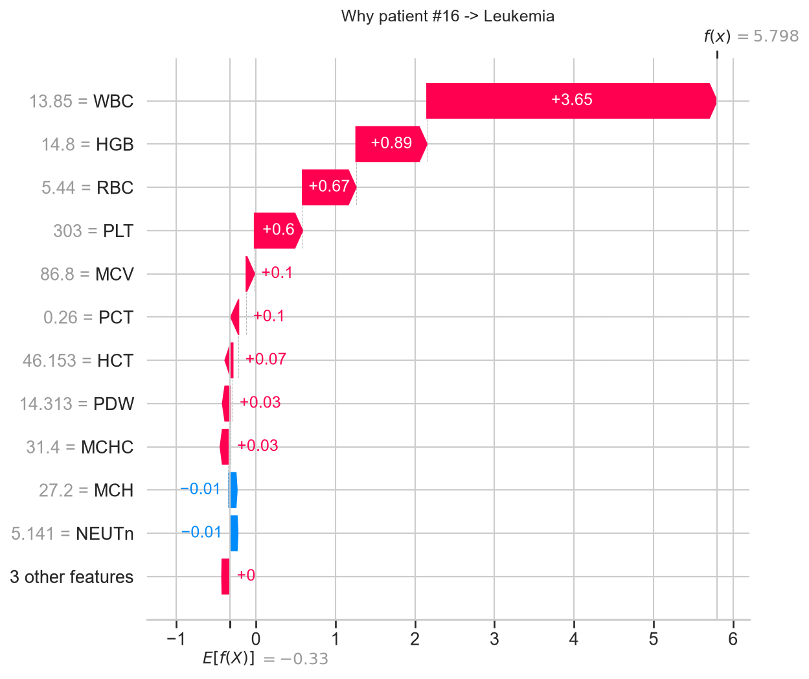

### Example 8 (CORRECT)

```
Patient #141  ->  predicted: Macrocytic anemia  (confidence 73.9%;  true label: Macrocytic anemia)
The model's baseline score for 'Macrocytic anemia' is -0.93. This patient's measurements adjust it as follows:
   MCV                          = 113        increases evidence for Macrocytic anemia by +4.02
   RBC                          = 1.96       increases evidence for Macrocytic anemia by +0.96
   MCH                          = 36.2       increases evidence for Macrocytic anemia by +0.21
   HGB                          = 7.1        increases evidence for Macrocytic anemia by +0.10
   PLT                          = 150        decreases evidence for Macrocytic anemia by -0.06
   MCHC                         = 32.1       decreases evidence for Macrocytic anemia by -0.00
   NEUTn                        = 5.14       increases evidence for Macrocytic anemia by +0.00
   LYMn                         = 1.88       increases evidence for Macrocytic anemia by +0.00
Net score for 'Macrocytic anemia' = +4.30, the highest of all 9 classes -> final prediction: Macrocytic anemia.
```

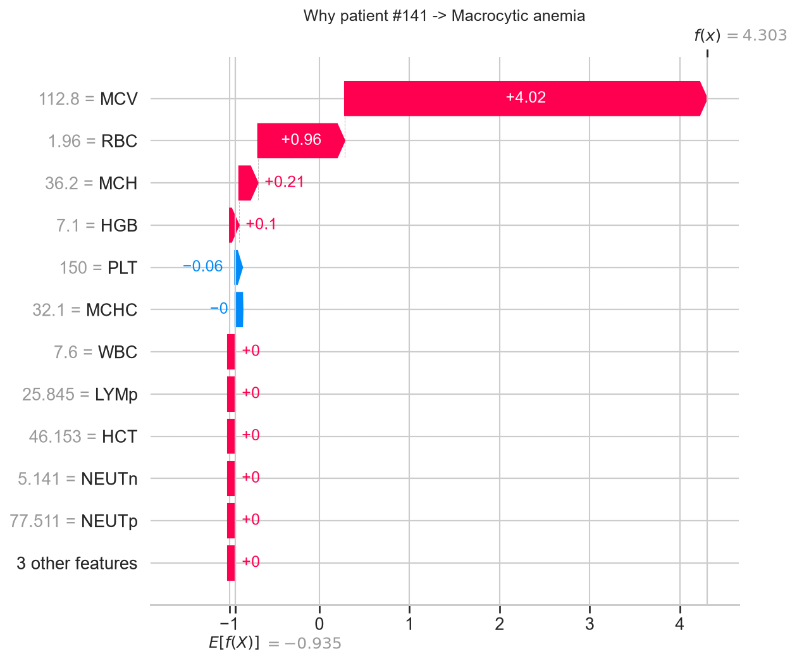

### Example 9 (CORRECT)

```
Patient #143  ->  predicted: Leukemia with thrombocytopenia  (confidence 41.6%;  true label: Leukemia with thrombocytopenia)
The model's baseline score for 'Leukemia with thrombocytopenia' is -1.44. This patient's measurements adjust it as follows:
   WBC                          = 11.6       increases evidence for Leukemia with thrombocytopenia by +1.02
   NEUTn                        = 9.3        increases evidence for Leukemia with thrombocytopenia by +0.93
   HCT                          = 45.2       increases evidence for Leukemia with thrombocytopenia by +0.48
   RBC                          = 5.24       increases evidence for Leukemia with thrombocytopenia by +0.31
   MCV                          = 86.4       decreases evidence for Leukemia with thrombocytopenia by -0.23
   PCT                          = 0.15       decreases evidence for Leukemia with thrombocytopenia by -0.17
   LYMp                         = 10.5       increases evidence for Leukemia with thrombocytopenia by +0.12
   PDW                          = 17.9       decreases evidence for Leukemia with thrombocytopenia by -0.10
Net score for 'Leukemia with thrombocytopenia' = +1.03, the highest of all 9 classes -> final prediction: Leukemia with thrombocytopenia.
```

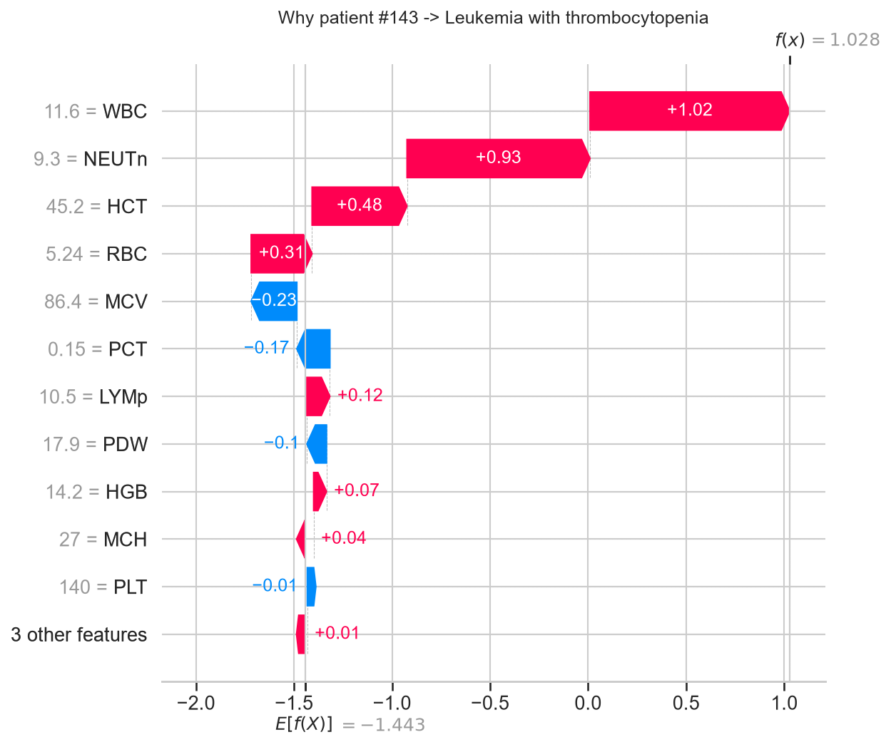

### Example 10 (MISCLASSIFIED)

```
Patient #9  ->  predicted: Macrocytic anemia  (confidence 46.7%;  true label: Leukemia)
The model's baseline score for 'Macrocytic anemia' is -0.93. This patient's measurements adjust it as follows:
   MCV                          = 124        increases evidence for Macrocytic anemia by +3.91
   RBC                          = 3.24       increases evidence for Macrocytic anemia by +0.96
   HGB                          = 13.4       decreases evidence for Macrocytic anemia by -0.27
   MCH                          = 41.4       increases evidence for Macrocytic anemia by +0.21
   PLT                          = 237        increases evidence for Macrocytic anemia by +0.03
   MCHC                         = 33.3       decreases evidence for Macrocytic anemia by -0.00
   NEUTn                        = 5.14       increases evidence for Macrocytic anemia by +0.00
   LYMn                         = 1.88       increases evidence for Macrocytic anemia by +0.00
Net score for 'Macrocytic anemia' = +3.90, the highest of all 9 classes -> final prediction: Macrocytic anemia.
```

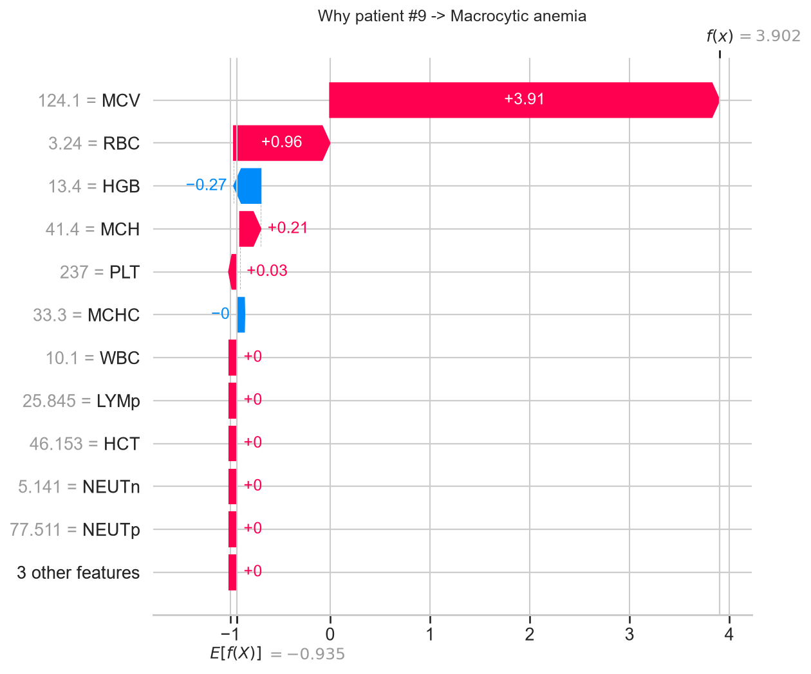

### Example 11 (MISCLASSIFIED)

```
Patient #14  ->  predicted: Healthy  (confidence 77.0%;  true label: Normocytic hypochromic anemia)
The model's baseline score for 'Healthy' is +1.00. This patient's measurements adjust it as follows:
   HGB                          = 41         increases evidence for Healthy by +2.42
   RBC                          = 13.1       increases evidence for Healthy by +0.80
   WBC                          = 2.7        increases evidence for Healthy by +0.75
   PLT                          = 169        increases evidence for Healthy by +0.73
   HCT                          = 2          decreases evidence for Healthy by -0.23
   MCV                          = 86.4       decreases evidence for Healthy by -0.15
   MCH                          = 27.4       decreases evidence for Healthy by -0.10
   NEUTn                        = 4.77       increases evidence for Healthy by +0.03
Net score for 'Healthy' = +5.29, the highest of all 9 classes -> final prediction: Healthy.
```

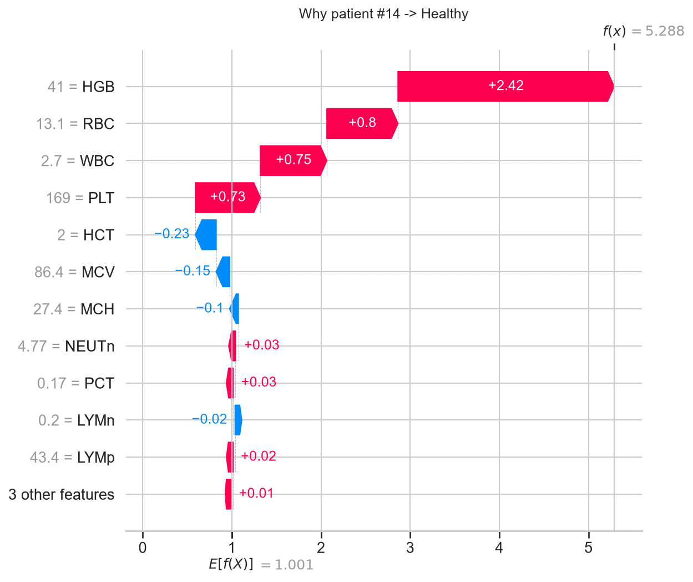
