# Experiment 2 -- Thyroid Disease (7 classes)

_Auto-generated report for the `thyroid` experiment._

## 1. Dataset

```
Dataset: thyroid -- Garavan Institute thyroid diagnoses (9,172 patients, 7 classes)
  samples : 9172
  features: 22 (20 numeric, 2 categorical)
  classes : 7
  class distribution:
      negative                           6771  (73.8%)
      hypothyroid                         659  ( 7.2%)
      nonthyroidal_illness                455  ( 5.0%)
      binding_protein                     388  ( 4.2%)
      replacement_therapy                 355  ( 3.9%)
      discordant_results                  282  ( 3.1%)
      hyperthyroid                        262  ( 2.9%)
```

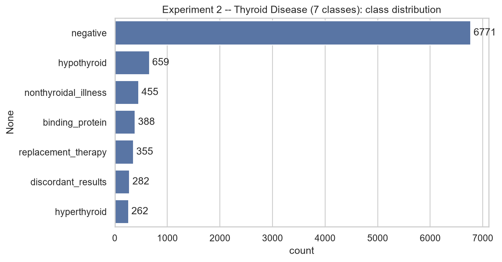

## 2. Stratified 5-fold cross-validation

|                        | accuracy          | macro_f1          | roc_auc_ovr       |
|:-----------------------|:------------------|:------------------|:------------------|
| Random Forest          | 0.9412 +/- 0.0078 | 0.8495 +/- 0.0240 | 0.9919 +/- 0.0026 |
| XGBoost                | 0.9504 +/- 0.0058 | 0.8721 +/- 0.0199 | 0.9951 +/- 0.0010 |
| Hybrid (RF+XGB)        | 0.9517 +/- 0.0048 | 0.8750 +/- 0.0175 | 0.9948 +/- 0.0011 |
| LightGBM               | 0.9506 +/- 0.0050 | 0.8729 +/- 0.0177 | 0.9944 +/- 0.0012 |
| Stacking (RF+XGB+LGBM) | 0.9508 +/- 0.0047 | 0.8736 +/- 0.0151 | 0.9911 +/- 0.0033 |


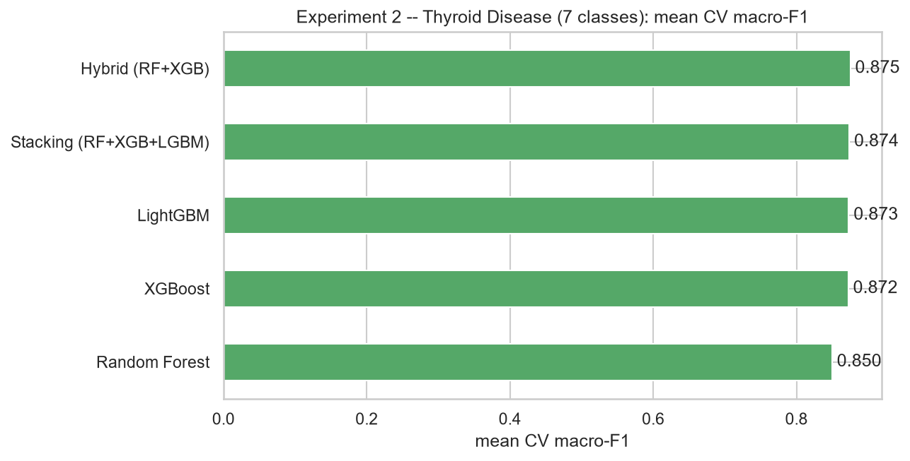

## 3. Statistical significance (paired t-test on fold macro-F1)

```
Paired t-test on 5 paired folds:
  mean(Hybrid (RF+XGB)) - mean(Random Forest) = +0.0255 (Hybrid (RF+XGB) is higher)
  statistic = 4.1608, p = 0.0141
  -> STATISTICALLY SIGNIFICANT at alpha = 0.05 (reject H0: equal performance)
```

## 4. Hold-out test evaluation (final hybrid)


Trained hybrid model saved to `outputs/models/thyroid_hybrid_model.joblib`.

| metric | value |
|---|---|
| accuracy | 0.9450 |
| balanced_accuracy | 0.8496 |
| macro_f1 | 0.8629 |
| weighted_f1 | 0.9435 |
| roc_auc_ovr | 0.9946 |


```
                      precision    recall  f1-score   support

            negative     0.9628    0.9742    0.9685      1355
         hypothyroid     0.9489    0.9848    0.9665       132
nonthyroidal_illness     0.9767    0.9231    0.9492        91
     binding_protein     0.8289    0.8077    0.8182        78
 replacement_therapy     0.9028    0.9155    0.9091        71
  discordant_results     0.7381    0.5536    0.6327        56
        hyperthyroid     0.8039    0.7885    0.7961        52

            accuracy                         0.9450      1835
           macro avg     0.8803    0.8496    0.8629      1835
        weighted avg     0.9431    0.9450    0.9435      1835

```


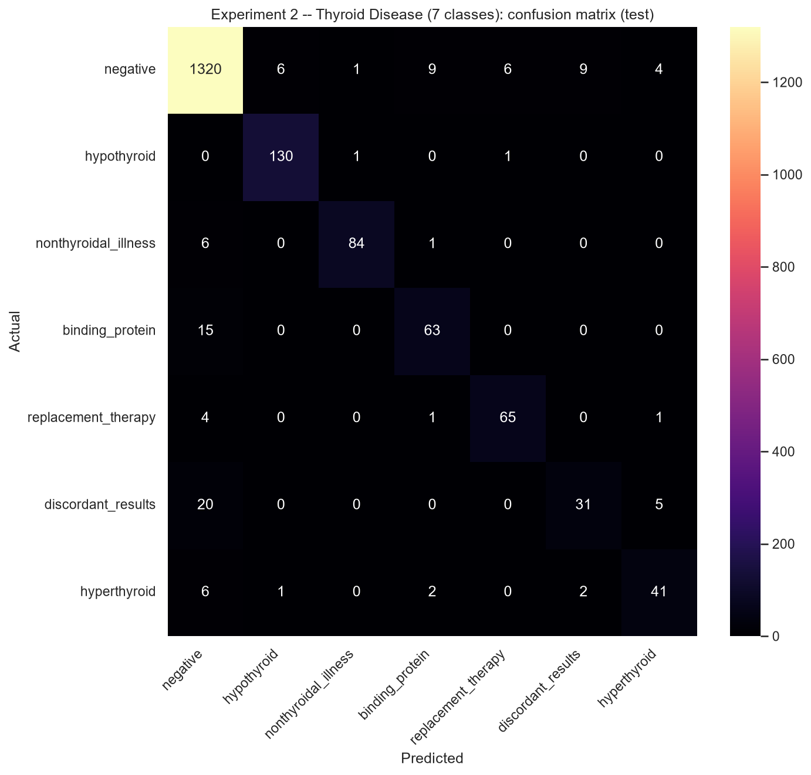


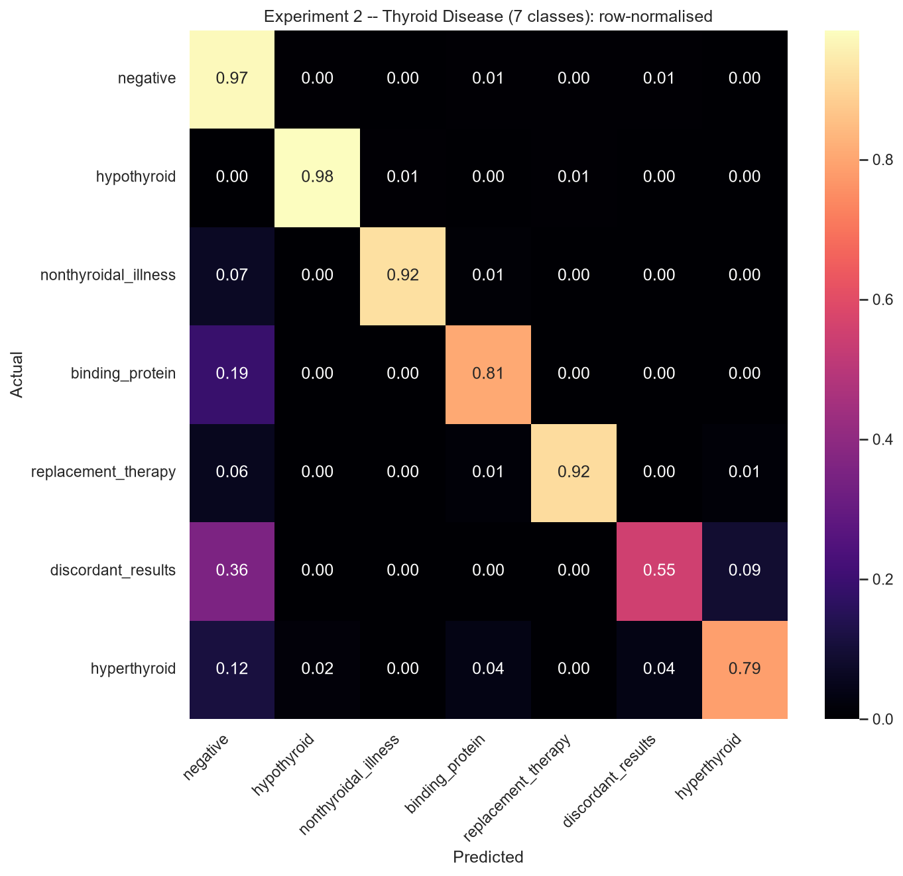


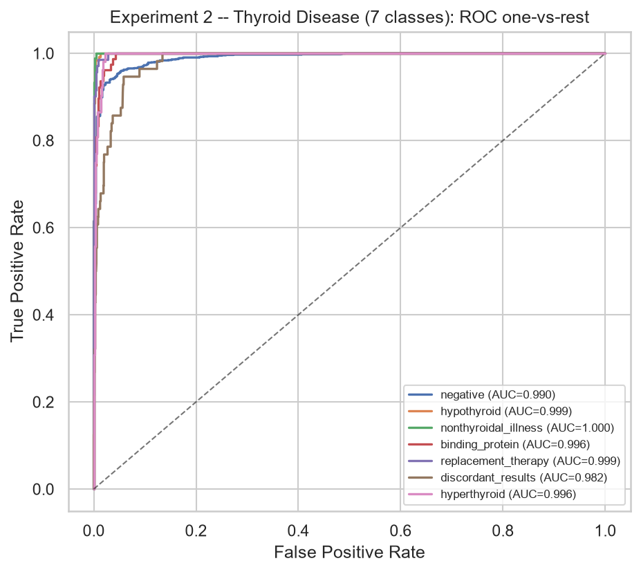

## 5. SHAP global explanation (XGBoost component)

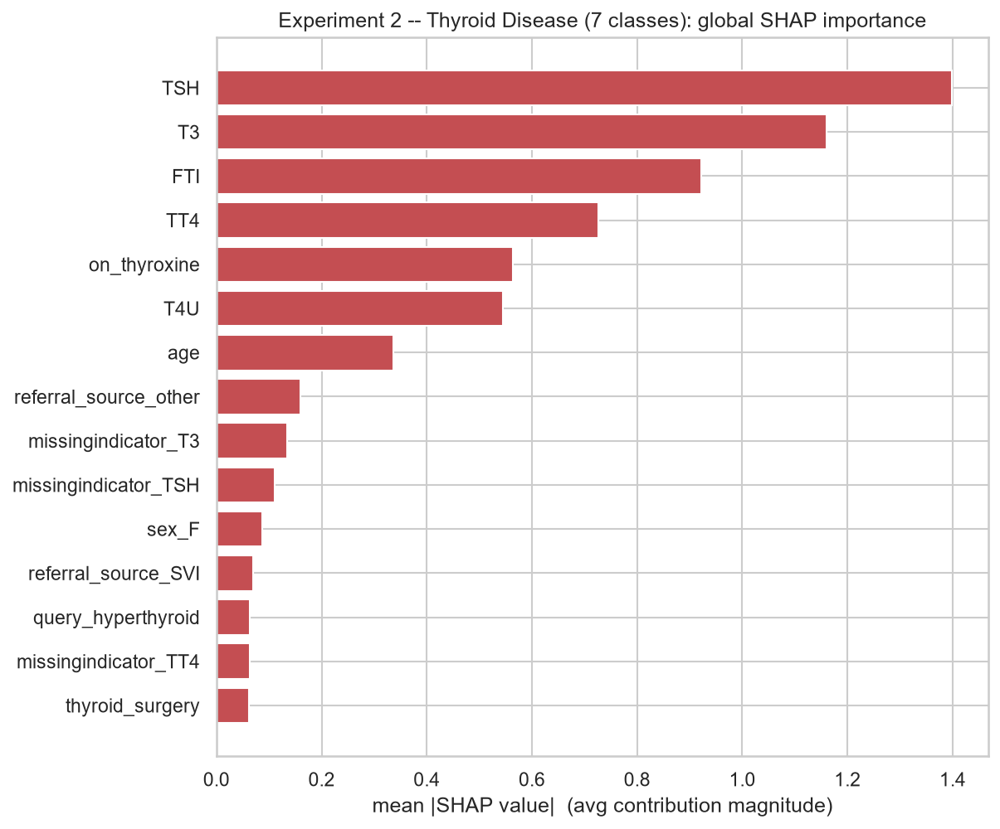


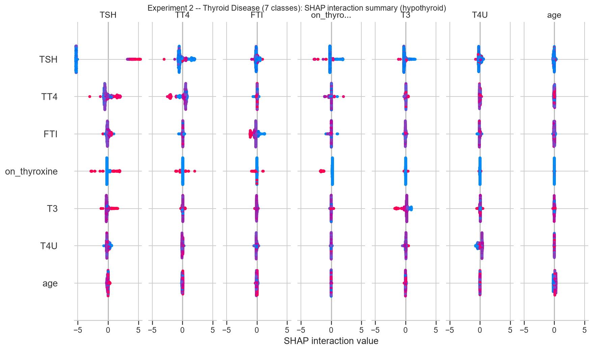


Top global features (mean |SHAP|):

```
TSH                      1.397816
T3                       1.160746
FTI                      0.921389
TT4                      0.726611
on_thyroxine             0.564411
T4U                      0.544076
age                      0.336323
referral_source_other    0.160033
missingindicator_T3      0.134628
missingindicator_TSH     0.111071
sex_F                    0.087147
referral_source_SVI      0.069457
```

## 6. SHAP local explanations -- why each prediction was made

### Example 1 (CORRECT)

```
Patient #0  ->  predicted: negative  (confidence 100.0%;  true label: negative)
The model's baseline score for 'negative' is +2.41. This patient's measurements adjust it as follows:
   TT4                          = 102        increases evidence for negative by +0.61
   T3                           = 2.3        increases evidence for negative by +0.43
   TSH                          = 0.52       increases evidence for negative by +0.40
   FTI                          = 109        increases evidence for negative by +0.38
   age                          = 27         increases evidence for negative by +0.24
   missingindicator_T3          = 0          increases evidence for negative by +0.16
   referral_source_other        = 1          increases evidence for negative by +0.07
   on_thyroxine                 = 0          decreases evidence for negative by -0.06
Net score for 'negative' = +4.55, the highest of all 7 classes -> final prediction: negative.
```

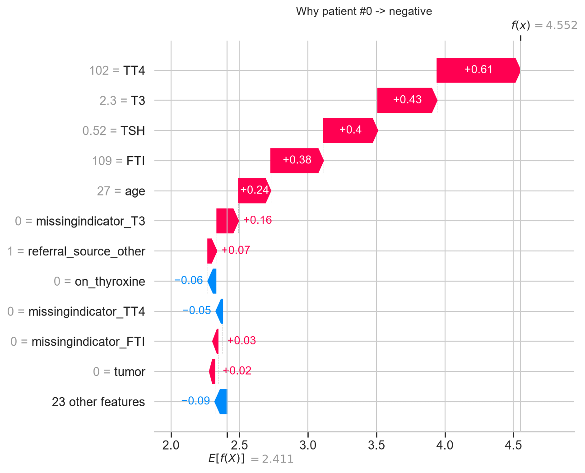

### Example 2 (CORRECT)

```
Patient #36  ->  predicted: hypothyroid  (confidence 86.9%;  true label: hypothyroid)
The model's baseline score for 'hypothyroid' is -0.44. This patient's measurements adjust it as follows:
   TSH                          = 6.4        increases evidence for hypothyroid by +3.80
   TT4                          = 141        increases evidence for hypothyroid by +0.55
   on_thyroxine                 = 0          increases evidence for hypothyroid by +0.38
   T3                           = 2.4        decreases evidence for hypothyroid by -0.21
   thyroid_surgery              = 0          increases evidence for hypothyroid by +0.19
   age                          = 61         increases evidence for hypothyroid by +0.16
   referral_source_other        = 0          increases evidence for hypothyroid by +0.08
   sex_F                        = 1          decreases evidence for hypothyroid by -0.05
Net score for 'hypothyroid' = +4.57, the highest of all 7 classes -> final prediction: hypothyroid.
```

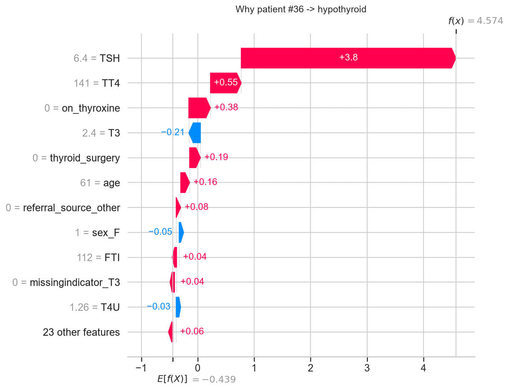

### Example 3 (CORRECT)

```
Patient #7  ->  predicted: nonthyroidal_illness  (confidence 94.7%;  true label: nonthyroidal_illness)
The model's baseline score for 'nonthyroidal_illness' is -0.46. This patient's measurements adjust it as follows:
   T3                           = 1          increases evidence for nonthyroidal_illness by +4.23
   referral_source_other        = 0          increases evidence for nonthyroidal_illness by +1.57
   age                          = 70         decreases evidence for nonthyroidal_illness by -0.57
   referral_source_SVI          = 1          increases evidence for nonthyroidal_illness by +0.41
   TT4                          = 112        increases evidence for nonthyroidal_illness by +0.28
   sex_F                        = 1          decreases evidence for nonthyroidal_illness by -0.18
   FTI                          = 110        increases evidence for nonthyroidal_illness by +0.17
   T4U                          = 1.02       decreases evidence for nonthyroidal_illness by -0.14
Net score for 'nonthyroidal_illness' = +5.51, the highest of all 7 classes -> final prediction: nonthyroidal_illness.
```

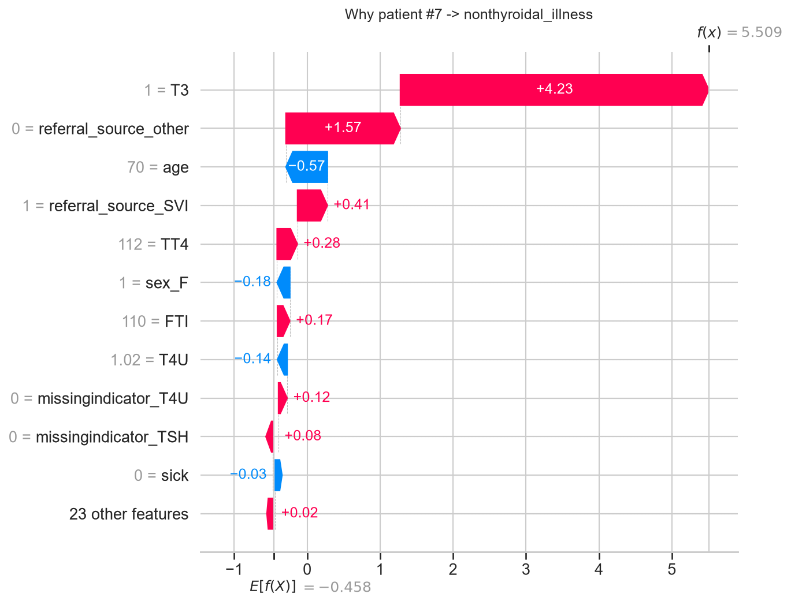

### Example 4 (CORRECT)

```
Patient #8  ->  predicted: binding_protein  (confidence 78.7%;  true label: binding_protein)
The model's baseline score for 'binding_protein' is -0.25. This patient's measurements adjust it as follows:
   T4U                          = 2.15       increases evidence for binding_protein by +3.81
   TSH                          = 33         decreases evidence for binding_protein by -2.33
   TT4                          = 234        increases evidence for binding_protein by +1.47
   missingindicator_T3          = 1          increases evidence for binding_protein by +0.66
   on_thyroxine                 = 0          increases evidence for binding_protein by +0.31
   referral_source_other        = 0          increases evidence for binding_protein by +0.29
   T3                           = missing    decreases evidence for binding_protein by -0.17
   FTI                          = 109        increases evidence for binding_protein by +0.16
Net score for 'binding_protein' = +3.98, the highest of all 7 classes -> final prediction: binding_protein.
```

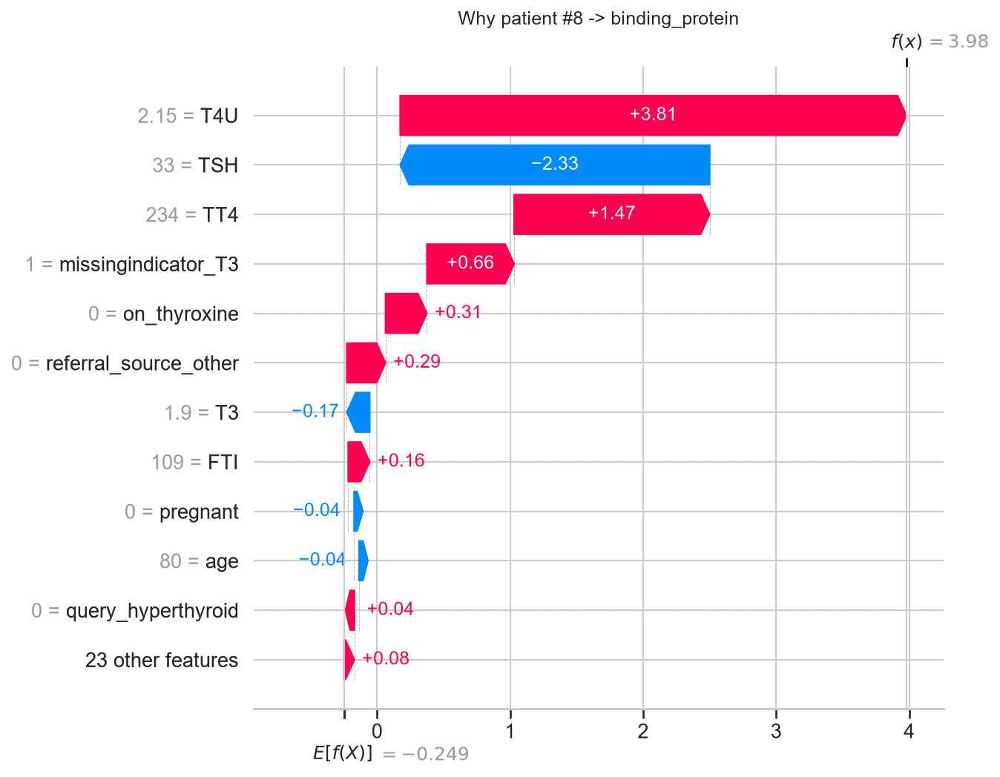

### Example 5 (CORRECT)

```
Patient #18  ->  predicted: replacement_therapy  (confidence 96.8%;  true label: replacement_therapy)
The model's baseline score for 'replacement_therapy' is -0.29. This patient's measurements adjust it as follows:
   on_thyroxine                 = 1          increases evidence for replacement_therapy by +3.62
   FTI                          = 164        increases evidence for replacement_therapy by +2.45
   TT4                          = 157        increases evidence for replacement_therapy by +1.87
   T4U                          = 0.96       increases evidence for replacement_therapy by +0.72
   T3                           = missing    increases evidence for replacement_therapy by +0.41
   TSH                          = 0.25       increases evidence for replacement_therapy by +0.19
   missingindicator_T3          = 1          decreases evidence for replacement_therapy by -0.11
   query_on_thyroxine           = 0          decreases evidence for replacement_therapy by -0.09
Net score for 'replacement_therapy' = +8.68, the highest of all 7 classes -> final prediction: replacement_therapy.
```

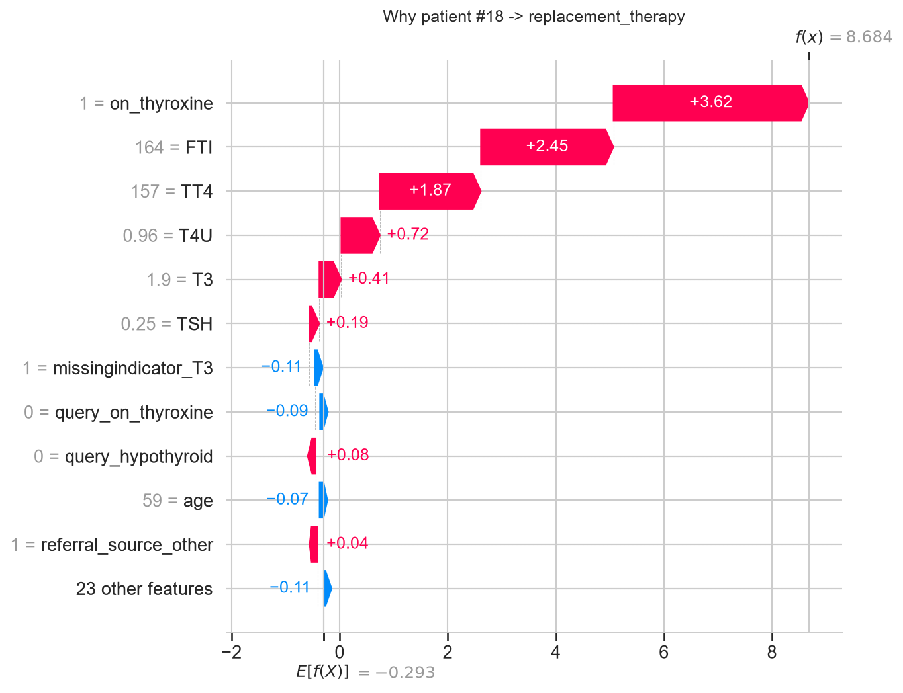

### Example 6 (CORRECT)

```
Patient #35  ->  predicted: discordant_results  (confidence 78.6%;  true label: discordant_results)
The model's baseline score for 'discordant_results' is -0.46. This patient's measurements adjust it as follows:
   FTI                          = 160        increases evidence for discordant_results by +3.62
   missingindicator_T3          = 0          increases evidence for discordant_results by +0.59
   on_thyroxine                 = 0          increases evidence for discordant_results by +0.36
   TT4                          = 146        increases evidence for discordant_results by +0.36
   age                          = 60         decreases evidence for discordant_results by -0.32
   TSH                          = 0.13       decreases evidence for discordant_results by -0.25
   T3                           = 1.3        increases evidence for discordant_results by +0.22
   sex_F                        = 1          decreases evidence for discordant_results by -0.14
Net score for 'discordant_results' = +3.85, the highest of all 7 classes -> final prediction: discordant_results.
```

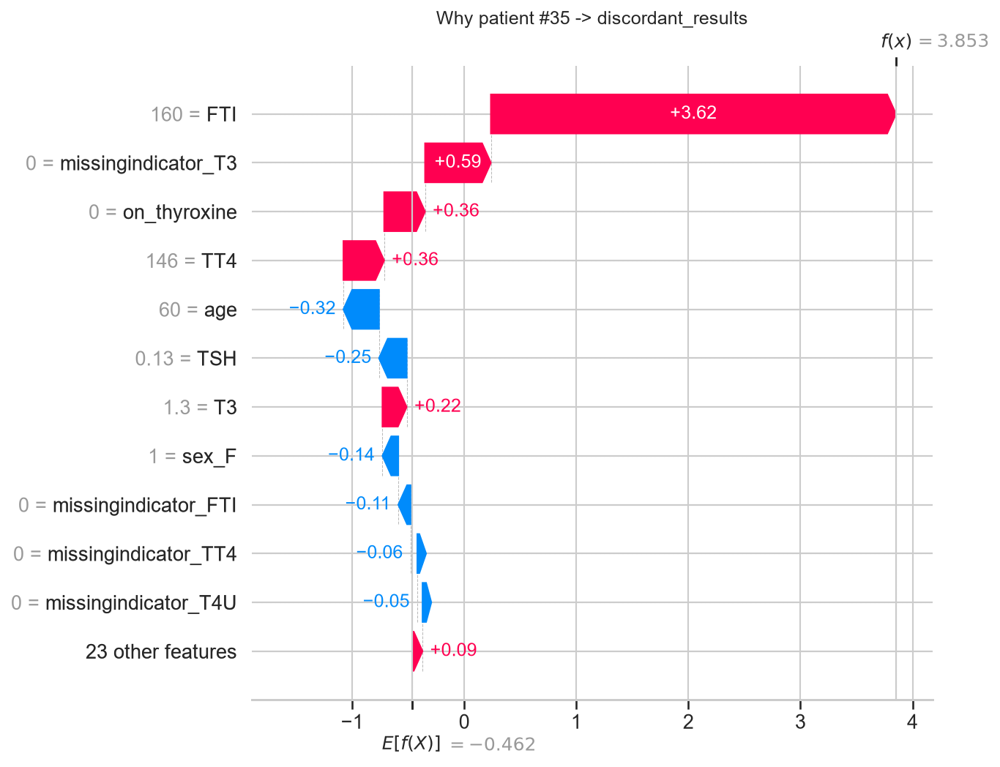

### Example 7 (CORRECT)

```
Patient #41  ->  predicted: hyperthyroid  (confidence 79.6%;  true label: hyperthyroid)
The model's baseline score for 'hyperthyroid' is -0.59. This patient's measurements adjust it as follows:
   FTI                          = 196        increases evidence for hyperthyroid by +3.21
   TSH                          = 0.02       increases evidence for hyperthyroid by +2.21
   TT4                          = 152        increases evidence for hyperthyroid by +0.67
   T3                           = 2.2        decreases evidence for hyperthyroid by -0.66
   on_thyroxine                 = 0          increases evidence for hyperthyroid by +0.45
   missingindicator_TSH         = 0          decreases evidence for hyperthyroid by -0.19
   referral_source_other        = 0          decreases evidence for hyperthyroid by -0.14
   missingindicator_T3          = 0          decreases evidence for hyperthyroid by -0.13
Net score for 'hyperthyroid' = +4.72, the highest of all 7 classes -> final prediction: hyperthyroid.
```

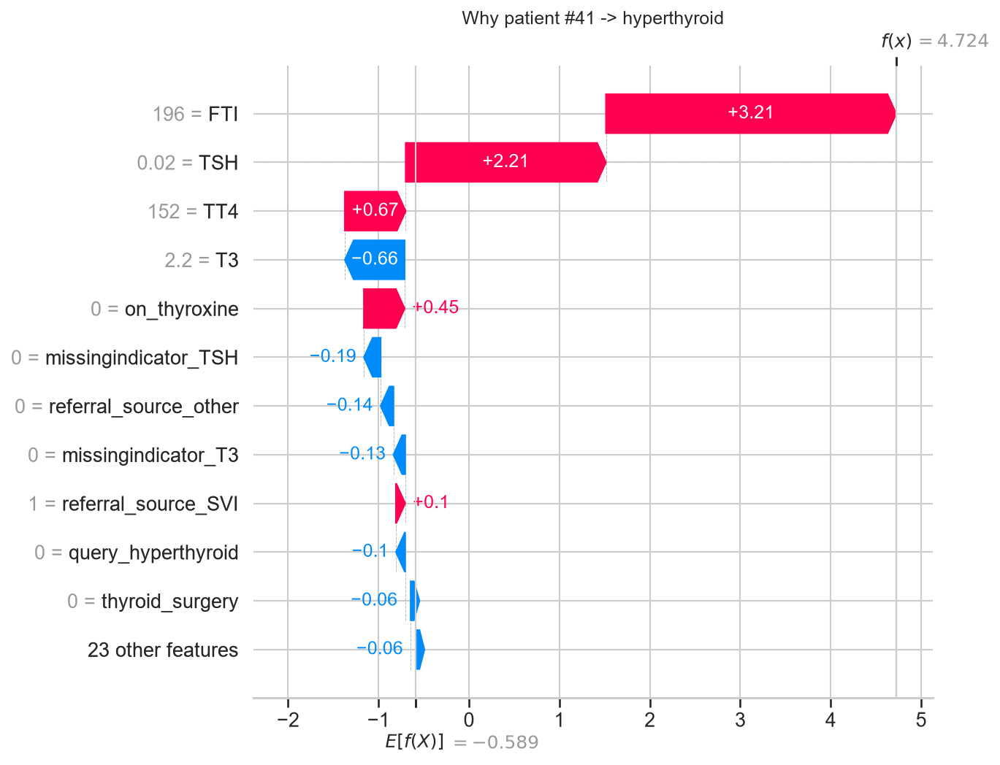

### Example 8 (MISCLASSIFIED)

```
Patient #37  ->  predicted: negative  (confidence 70.7%;  true label: discordant_results)
The model's baseline score for 'negative' is +2.41. This patient's measurements adjust it as follows:
   T3                           = 4.1        decreases evidence for negative by -1.72
   TT4                          = 115        increases evidence for negative by +0.40
   FTI                          = 120        increases evidence for negative by +0.34
   TSH                          = 0.08       increases evidence for negative by +0.32
   T4U                          = 0.96       increases evidence for negative by +0.13
   missingindicator_T3          = 0          increases evidence for negative by +0.11
   sex_F                        = 0          increases evidence for negative by +0.10
   referral_source_other        = 1          increases evidence for negative by +0.08
Net score for 'negative' = +2.01, the highest of all 7 classes -> final prediction: negative.
```

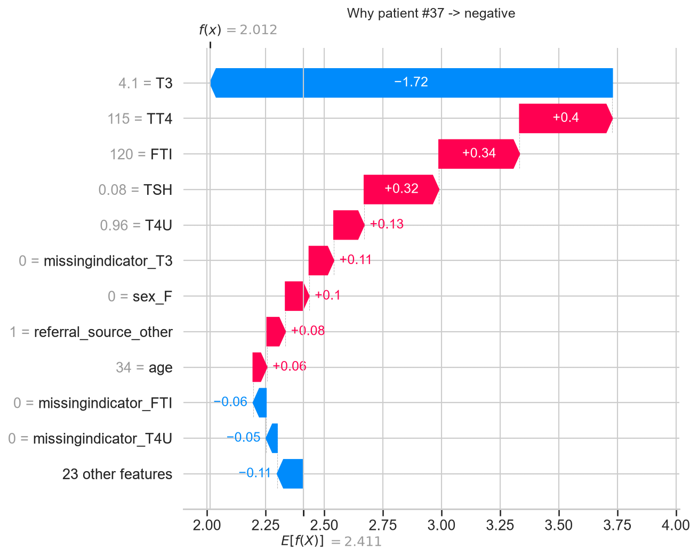

### Example 9 (MISCLASSIFIED)

```
Patient #42  ->  predicted: negative  (confidence 55.2%;  true label: discordant_results)
The model's baseline score for 'negative' is +2.41. This patient's measurements adjust it as follows:
   TT4                          = 39         decreases evidence for negative by -2.27
   TSH                          = 0.05       increases evidence for negative by +0.85
   FTI                          = 39         decreases evidence for negative by -0.52
   missingindicator_TSH         = 0          decreases evidence for negative by -0.11
   T4U                          = 1          increases evidence for negative by +0.09
   T3                           = 1.6        increases evidence for negative by +0.08
   on_thyroxine                 = 0          decreases evidence for negative by -0.06
   referral_source_other        = 1          increases evidence for negative by +0.06
Net score for 'negative' = +0.52, the highest of all 7 classes -> final prediction: negative.
```

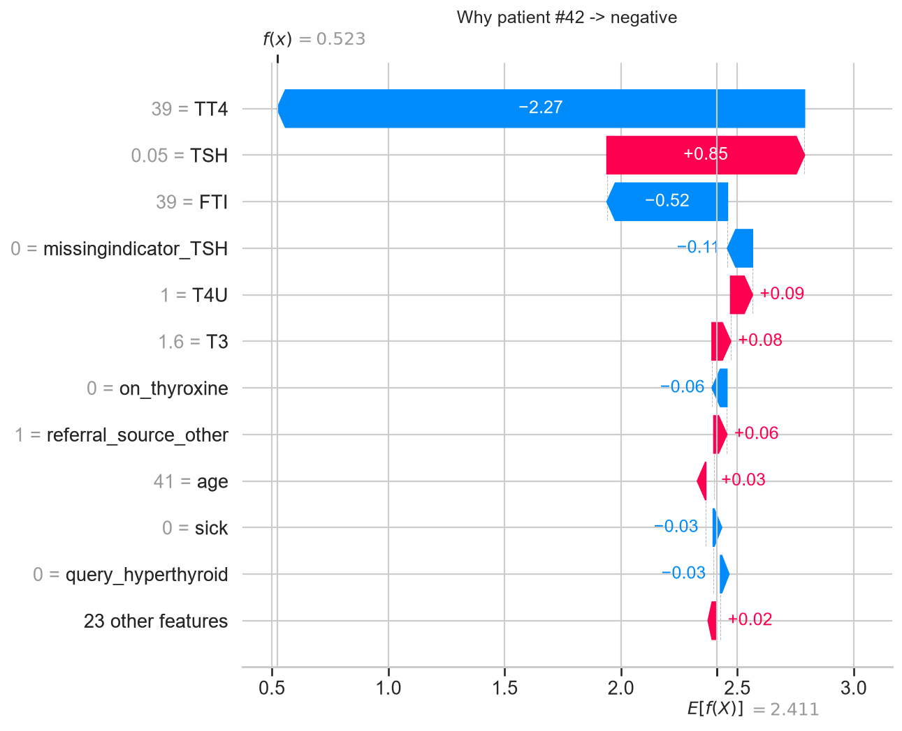
